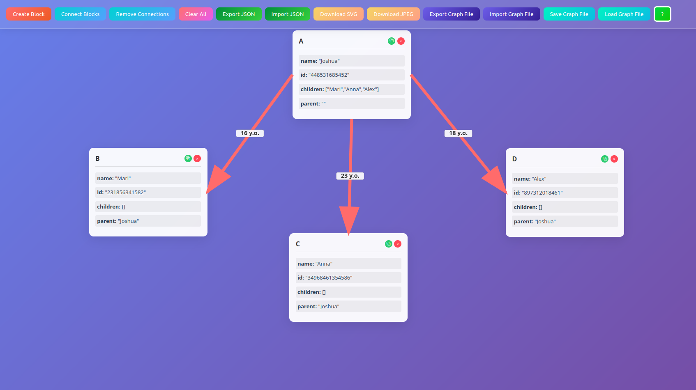
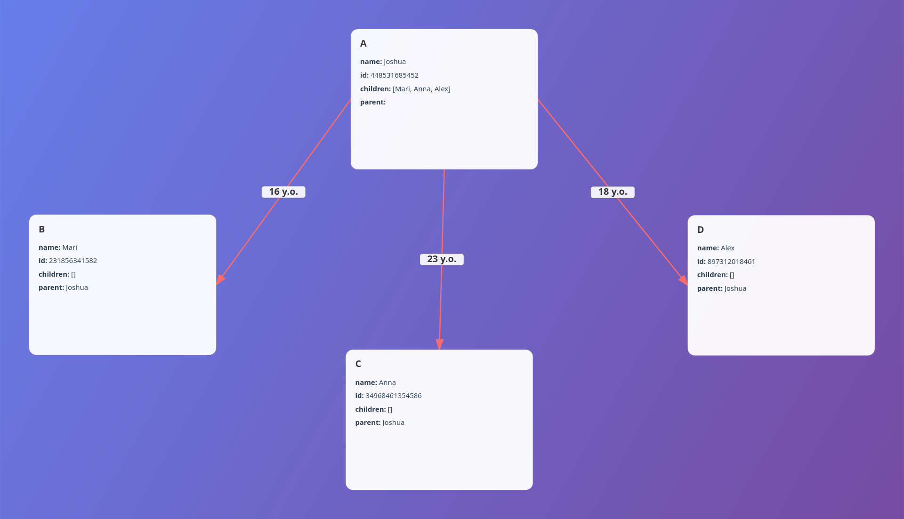

# json-object-viewer
View JSON objects on your Web browser: 



Export as JPEG/SVG:



Export/Import as JSON file:

```json
{
    "A": {
        "id": "448531685452",
        "name": "Joshua",
        "children": [
            "Mari",
            "Anna",
            "Alex"
        ],
        "parent": ""
    },
    "B": {
        "id": "231856341582",
        "name": "Mari",
        "children": [],
        "parent": "Joshua"
    },
    "C": {
        "id": "34968461354586",
        "name": "Anna",
        "children": [],
        "parent": "Joshua"
    },
    "D": {
        "id": "897312018461",
        "name": "Alex",
        "children": [],
        "parent": "Joshua"
    }
}
```
You can also save/load a project `graph.json` file to continue editing it later. It keeps all connections and metadata intact.

## Install
```sh
$ git clone git@github.com:kirillsaidov/json-object-viewer.git
```

### Run
Run directly in developer mode:
```sh
# install python dependencies
python3 -m venv venv && source ./venv/bin/activate
pip install -r requirements.txt

# run app
uvicorn src.main:app --reload --port 8505
```

Run using Docker:
```sh
# build container
docker buildx build -f Dockerfile -t json-object-viewer:latest .

# run app
docker run -d --network=host --name=json-object-viewer \
    json-object-viewer:latest -b 0.0.0.0:8505 -w 1
```

## LICENSE
Unlicense.
