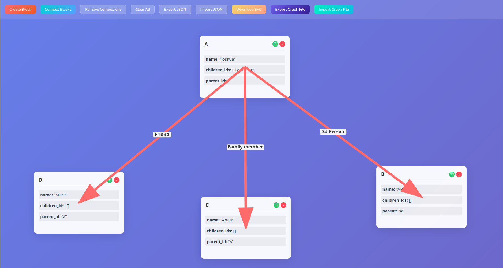
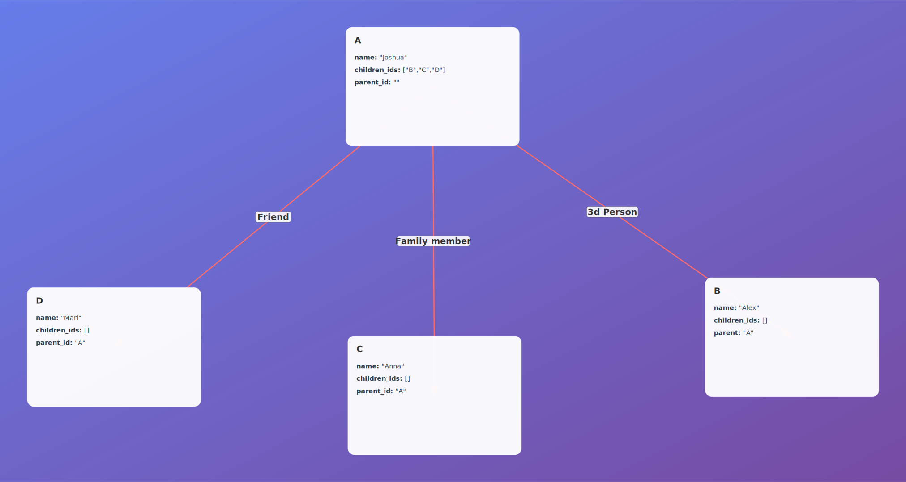

# json-object-viewer
View JSON objects on your Web browser: 



Export as SVG:



Export/Import as json:

```json
{
  "A": {
    "id": "A",
    "name": "Joshua",
    "children_ids": [
      "B",
      "C",
      "D"
    ],
    "parent_id": ""
  },
  "B": {
    "id": "B",
    "name": "Alex",
    "children_ids": [],
    "parent": "A"
  },
  "C": {
    "id": "C",
    "name": "Anna",
    "children_ids": [],
    "parent_id": "A"
  },
  "D": {
    "id": "D",
    "name": "Mari",
    "children_ids": [],
    "parent_id": "A"
  }
}
```
You can also save/load a `graph.json` file to continue editing it later.

## Install
```sh
$ git clone --recurse-submodules git@github.com:kirillsaidov/json-object-viewer.git
```

### Run
Run directly in developer mode:
```sh
# install python dependencies
python3 -m venv venv && source ./venv/bin/activate
pip install -r requirements.txt

# run app
uvicorn src.main:app --reload --port 8505
```

Run using Docker:
```sh
# build container
docker buildx build -f Dockerfile -t json-object-viewer:latest .

# run app
docker run -d --network=host --name=json-object-viewer \
    json-object-viewer:latest -b 0.0.0.0:8505 -w 1
```

## LICENSE
Unlicense.
